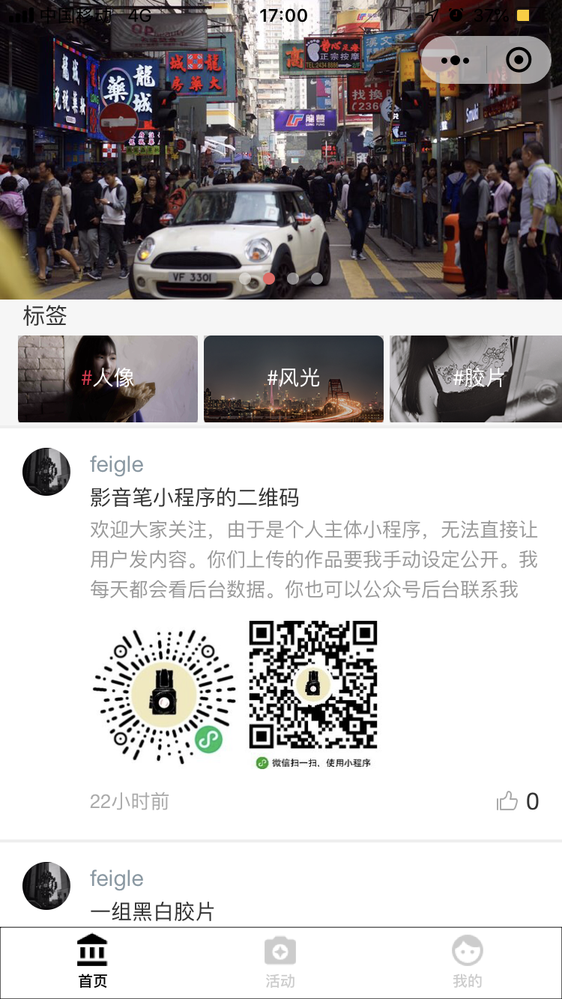
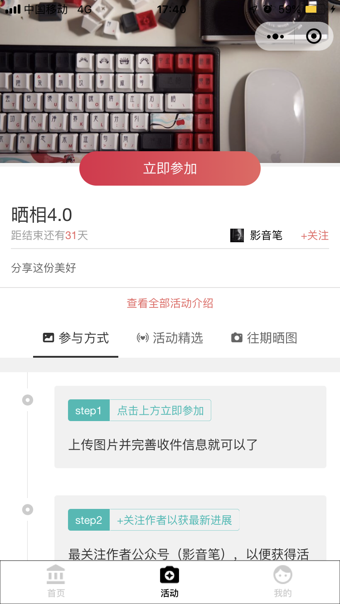
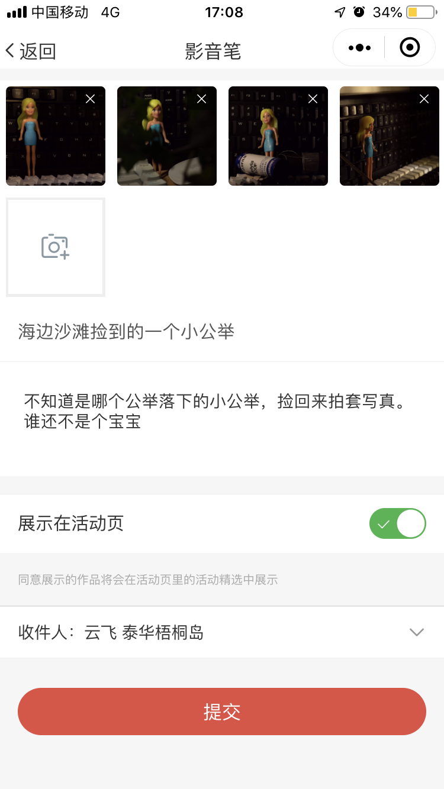
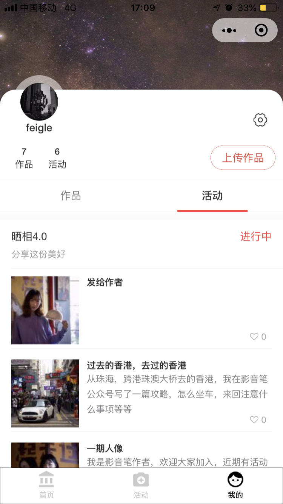

> 最近遇到了糟心的问题，由于我的小程序是个人号，而开发的小程序涉及了用户自行发布内容（这部分功能在个人号未开放，可能微信也不打算开放），所以无法通过微信审核。

>目前只有两种选择，第一就是注册企业号，第二就是去掉用户发布内容的功能。

>第一种方法显然不行。只能走第二条路了。这样话，之前花了大量时间和精力做的功能都要去掉。去掉的功能差不多占到了80%。一下子回到最初的起点。

## 进度
  这个程序已经写了一年了。没错，已经一年了。从最初的想法到现在的实现，花了整整一年的业余时间，很多宅家的周未，无数个下班后直奔回来的夜晚。

目前已经上线了，所有的微信用户都可以看到啦（附二维码）

  小程序的功能并不复杂，很多功能都是参考了同类的软件做的。但是同类型的软件都不是开源的。所以也看不到它们的源代码，只能凭自己想像力来做出相同的功能。

  小程序自己测了一下，没有太大的问题。接到不能通过审核的通知后，开始思考如何修改。最后打算保留用户可以上传图片作品的功能，但是要我在后台数据上做一些设置就可以在小程序上看到了。

所以我又为此写了一个简易的后台管理的界面: 

只需要在上面设置一下，就可以让用户的作品发布了。

唯一不足的地方是用户在上传作品的时候，加了好多提示。可能会导致用户体验不是很好。

## 为何设计

影笔小程序最初的设计很简单，就是希望公众号的粉丝能够更加方便的参加晒相活动。（个人设的一个活动，免费的给粉丝冲印一些摄影作品，分享纸质作品给人带来的快乐）

以前是用邮件的方式将图片发给我。比较麻烦。

有了小程序之后可以在小程序上直接上传。后来做着做着想法越来越多，原先设计的是想将自己以前的一些摄影作品和博文写到小程序， 现在任何人都可以上传自己的作品，作为一个个人博客来使用。并且还给它加入了点赞的功能。

## 都做了什么功能花了这么久？

我作为一个开发者，在完成这个程序后都感觉内容还是有点单薄。但仔细列举一下，还是会发现一路走来遇到很多很难迈过的坎。比如说，数据库的设计、图片的压缩与处理等等。

当然，为了给用户一个更好的体验，我还买了一个服务器，买了一个域名。也写了一个网站： [www.yingyinbi.com](http://www.yingyinbi.com)

同时，还要写一个后台管理的网页，用来管理用户上传的资料。当然这个网页我在自己电脑里运行就可以了。

首选一个互联网产品的出现，一般会经历以下过程： 

需求产生： （产品的作用，受用人群，会带来的收益，需要投入的时间精力和金钱。。。）

原型的设计： 画（或描述，一般是画）产品应用是什么样子的。

UI设计： UI设计师跟据原型用深厚的美术功底画出漂亮的界面。

开发： 程序员加班的日子。

测试： 程序员改bug 的日子。

上线： 用户可以使用了。

后续： 产品发展好就会不断的更新优化。发展不好整个团队就亏，这个产品也就到此为止。

影音笔小程序不是一个正而八经的互联网产品，它的诞生，一来是作者想通过互联网的手段优化原来的晒想活动（压根也没有多少个人参与，但是很感谢参与的人，谢谢你们对我的信任），其次是作者另一个目的通过制作这个小程序提升自己的职业能力。

所以颢音笔小程序没有考虑收益，没有UI设计，连测试也只有作者，还有B站来的一位粉丝（非常感谢）。

 
## 使用

### 首页
首页是展示用户作品的主要窗口。

顶部的轮翻图设计是用来展示热门作品的（也可以私我把你的放上去），就也属于传说中的平台流量了。

如果上传自己的作品，到‘我的’页面，登录就可以看到入口了。

首页内作品是按照时间顺序来排的， 以后看能不能做成按热度穿插排序。

## 活动页

活动页目前设计用于收集晒相作品（以后预计可以发布其他活动）。同时作为用户的你也可以提活动，不过要联系我来配置。

点击“立即参加”就可以上传自己的作品了。

注意： 
* 由于作者资金有限，用的是书信的形式，确保你的地址是可以收到信件的（可以找学校/政府机构的朋友代收）。所以**邮编是必填的**，最好将邮箱写一下（也可以将wechat写在那里）。影音笔只是预防系统出错时可以联系上你，不会泄漏用户的任何信息。
* 可以上传的作品张数可以很多，但是信件是有重量限制的，到时候会看情况分开寄或随机晒几张。

## 我的页

这是个人页，当前用户上传的作品都在这了， 长按图片可以执行删除操作。

其中，活动作品点击进入后有个“发show”的入口，是希望你在收到图片后给我发一个“买家秀”式的图文。没什么，就是我知道你收到后就会很开心。

当然你也可以公开分享给大家（所有用户在活动页的第三个标签处可以看到）, 如果不公开，只有我在后台能看到。

## 我想说的
开发不易，个人水平有限，有点bug一定尽快解决。

所有使程序变得强大的意见都可以在公众号给我留言。

## 福利

在测试有朋友发布后的活跃用户中，我会筛选几个人。

如果你是摄影师，帮你**晒好多张图片作品，用快递寄给你**。

如果你是模特，送一套**胶片写真**, 并冲晒出来（地点深圳，广州也行）

## 后面的安排

除了改改发现的bug，就先发布给粉丝用了，肯定会有很多的不足。对说这些不足会一步步的改进。（假如用户不多，甚到没有用户的话，就不改了）。

接下来的日子更多的是将时间抽出来看看去年双11和今年618买的那些书。其实一味的开发软件，并不会对一个开发者技术上有太大的提升，时不时的，还是要花多点时间研究一下基础原理，数学算法等。

好好的准备一下，迎接更好的自己。

